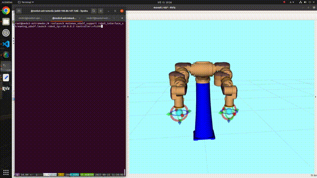

# sda5f_tutorials

- ROS package for YASKAWA MOTOMAN SDA5F tutorial.
  - For more details, please refer to [catkin_ws/src/sda5f_tutorials/README.md](catkin_ws/src/sda5f_tutorials/README.md)
- Docker for simulation and control environments for YASKAWA MOTOMAN SDA5F.

## Requirements for docker environment

- Ubuntu 20.04
  - RTX3080
    - NVIDIA Driver 470.103.01
  - docker 20.10.12
  - docker-compose 1.29.2
  - nvidia-docker2 2.8.0-1

## Dependencies for tutorial programs

- [ROS Kinetic](http://wiki.ros.org/kinetic/Installation/Ubuntu)
- [ros-industrial/motoman](https://github.com/ros-industrial/motoman)
- [qqfly/motoman_sda5f_pkg](https://github.com/qqfly/motoman_sda5f_pkg)

## Installation

```
git clone git@github.com:Osaka-University-Harada-Laboratory/sda5f_tutorials.git
cd sda5f_tutorials/catkin_ws
git clone -b kinetic-devel git@github.com:ros-industrial/motoman.git src/motoman
git clone git@github.com:qqfly/motoman_sda5f_pkg.git src/motoman_sda5f_pkg
cd ../
docker-compose build
docker-compose up
```

## Usage
#### Host machine
```
xhost +
docker exec -it sda5f_container bash
```

#### Docker container
```
./wiggle.bash
```
  

## Author / Contibutor

[Takuya Kiyokawa](https://takuya-ki.github.io/)

## License

This software is released under the MIT License, see [LICENSE](./LICENSE).
